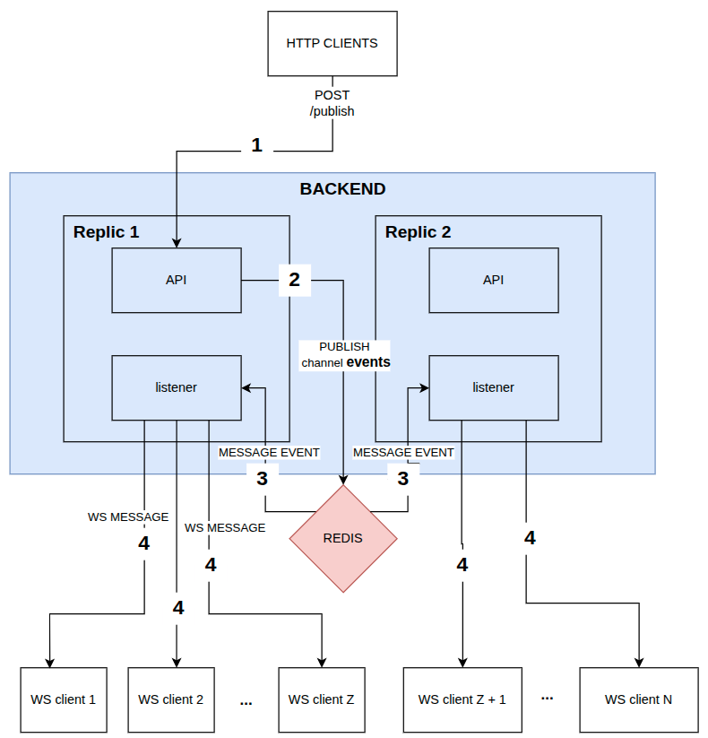
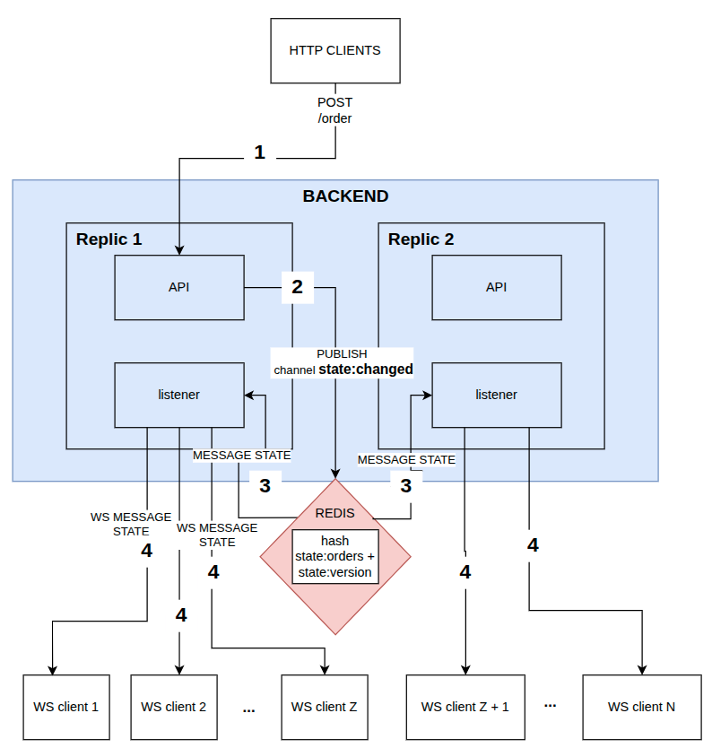
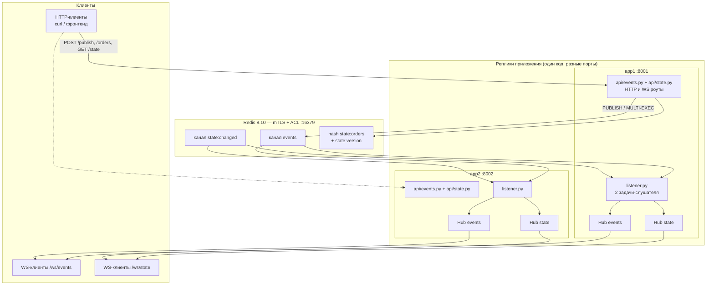
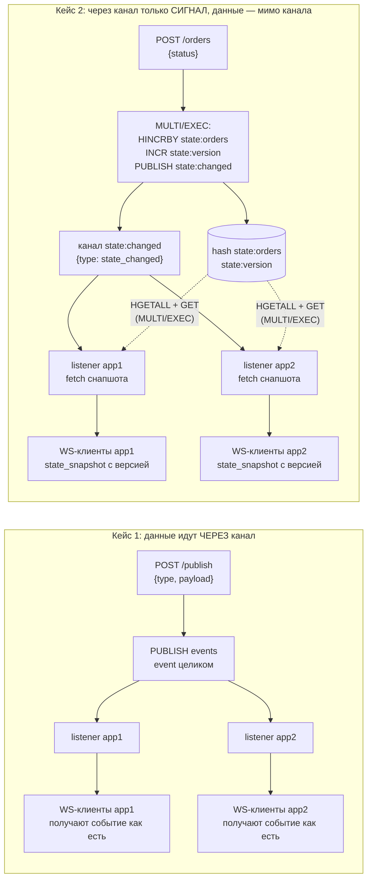
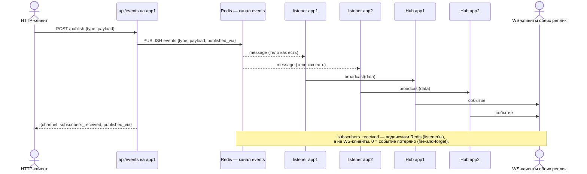
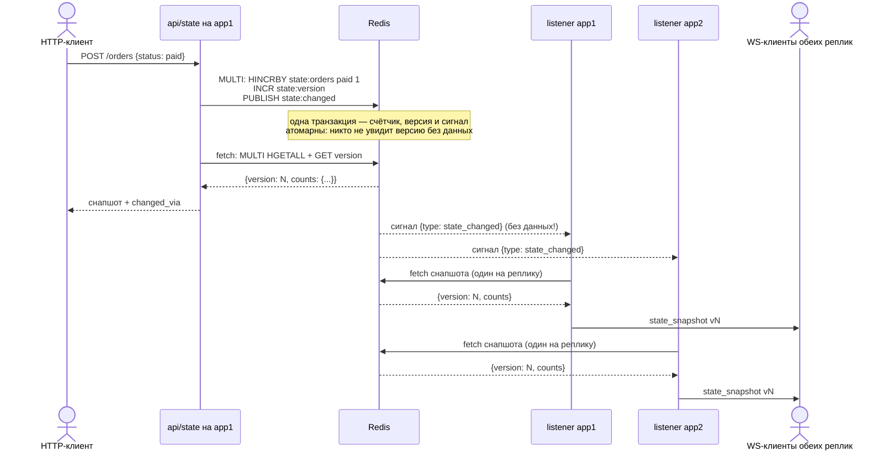
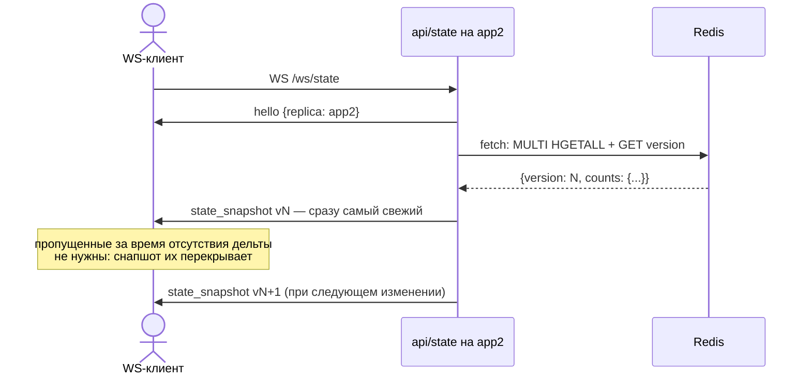

# Redis Pub/Sub

Демо-проект «Redis beyond caching»: синхронизация WS-реплик приложения **без «миганий»**
через Redis Pub/Sub. Две одинаковые реплики FastAPI-приложения (app1, app2) держат
WebSocket-соединения с клиентами; изменение, сделанное через любую реплику, становится
видимым на всех — без поллинга, без общей памяти реплик и без брокера вроде Kafka.

Проект демонстрирует два разных способа использовать Pub/Sub:

| Кейс | Задача | Что летит в канале | Что получает WS-клиент |
|------|--------|--------------------|------------------------|
| **1. Broadcast-события** | разослать событие всем | готовые данные события | каждое событие отдельно |
| **2. Notify + fetch** | синхронизировать состояние | только сигнал «изменилось» | снапшот состояния с версией |

---

## Кейсы

### Кейс 1 — broadcast-события (fan-out)



`POST /publish` → `PUBLISH` в канал `events` → listener **каждой** реплики получает
сообщение и рассылает его своим WS-клиентам `/ws/events`.

Тело события отправляется в канал **как есть** — Redis здесь чистая шина доставки.
Природа Pub/Sub — fire-and-forget: пропущенное при обрыве теряется навсегда.
Это нормально для событий («заказ оплачен», «курьер выехал»): важно получить
новейшие, а не восстановить историю.

### Кейс 2 — notify + fetch (синхронизация состояния)



`POST /orders` → атомарное изменение в Redis (hash + версия) + сигнал `state:changed`
в канал → каждая реплика по сигналу **читает снапшот из Redis** и рассылает его
своим WS-клиентам `/ws/state`.

В канал летит **крошечный сигнал без данных**; сами данные живут в Redis
(`state:orders` + `state:version`). Зачем так:

- **один fetch на реплику, а не на клиента**;
- **снапшот перекрывает пропущенное** — клиенту, подключившемуся в любой момент
  (или переподключившемуся после обрыва), не нужны пропущенные дельты, ему сразу
  отдаётся самое актуальное состояние;
- **версия в каждом снапшоте** — клиент отбрасывает устаревшее и применяет
  состояние атомарно, без «миганий» (см. [правила клиента](#правила-ws-клиента-против-миганий)).

---

## Архитектура



### Элементы

| Элемент | Что это | Зачем нужен |
|---------|---------|-------------|
| **Реплика** (app1/app2) | экземпляр FastAPI-приложения с общим кодом, но своим портом и `replica_id` | модель продакшена за балансировщиком: клиенты висят на разных репликах, а видеть должны одно состояние |
| **`api/events.py`** | роуты и логика кейса 1: `POST /publish`, `WS /ws/events` + свой `Hub` | весь кейс читается одним файлом — от HTTP до рассылки |
| **`api/state.py`** | роуты и логика кейса 2: `GET /state`, `POST /orders`, `WS /ws/state` + свой `Hub` + операции с состоянием | то же для синхронизации состояния |
| **`Hub`** (`hub.py`) | множество WS-соединений, висящих на **этой** реплике, и рассылка им (`SEND_TIMEOUT=2s`) | чисто локальный транспорт «сервер → мои клиенты»; про Redis ничего не знает. Таймаут отцепляет медленных, чтобы они не тормозили рассылку остальным |
| **`listener.py`** | фоновая задача: `SUBSCRIBE` → цикл `listen()` → обработчик; при обрыве переподключается и поднимает подписку заново | каждая реплика должна получать сообщения канала; переподключение уменьшает окно потерь (fire-and-forget всё равно теряет пропущенное) |
| **`app.py`** | точка сборки: lifespan (Redis-клиент + два слушателя), `include_router`, `/health` | здесь видно, как кейсы подключаются к инфраструктуре |
| **`redis_client.py`** | async-клиент Redis поверх mTLS (CA + клиентский сертификат) + ACL | защита канала до Redis и аутентификация — так настроена инфраструктура |
| **`config.py`** | `pydantic-settings`: порт, `replica_id`, доступ к Redis, имена каналов | реплики различаются только переменными окружения (`PORT`, `REPLICA_ID`) |
| **Redis** | шина сообщений (Pub/Sub) + хранилище состояния (hash + счётчик версии) | общий «посредник»: репликам не нужно знать друг о друге |
| **`ws_client/`** | консольный WS-клиент (`uv run ws --port 8001`) | удобно смотреть поток сообщений вручную |

### Взаимодействия и их смысл

1. **Реплика ↔ Redis — команды.** Реплики не шлют сообщения друг другу
   напрямую: всё через Redis. Добавили третью реплику — она просто подписывается на те же
   каналы, ничего менять не нужно.
2. **PUBLISH получают все подписчики канала.** Ответ `PUBLISH` — число подписчиков Redis
   (в `/publish` это `subscribers_received`), **не** число WS-клиентов. Если оно 0 —
   в этот момент слушателей не было, и событие потеряно (природа Pub/Sub).
3. **Обработчик слушателя знает Redis** (сигнатура `(redis, data)`): кейсу 1 данные уже
   в сообщении, а кейсу 2 нужен fetch снапшота по сигналу.

---

## Схема движения данных

Главная разница кейсов — **где лежат данные**:



- **Кейс 1 (слева):** сообщение канала = готовое событие. Минус: если клиенту нужно
  «текущее состояние», события не помогут — он не знает, что было до него.
- **Кейс 2 (справа):** сообщение канала = будильник «состояние изменилось». Данные
  каждый раз читаются из Redis свежими, поэтому опоздавший клиент получает сразу всё,
  а не фрагменты. Минус: на каждое изменение — дополнительный fetch (но один на реплику).

Записи в Redis живут отдельно от Pub/Sub: канал забывает сообщения мгновенно,
а hash с состоянием — постоянное хранилище (в контейнере включён AOF — appendonly,
данные переживают перезапуск).

---

## Диаграммы последовательности

### 1. Кейс 1: публикация broadcast-события



**Зачем каждое действие:**
- `PUBLISH` — один запрос доставляет событие всем подписчикам; отправителю не нужно
  знать, сколько реплик и где они;
- `published_via` в сообщениио — метка, какая реплика опубликовала (удобно для отладки);
- рассылка в Hub идёт по одному клиенту с таймаутом (`SEND_TIMEOUT=2s`): медленный
  клиент отцепляется, остальные не ждут;
- входящие сообщения WS-клиентов игнорируются — канал односторонний.

### 2. Кейс 2: изменение состояния (notify + fetch)



**Зачем каждое действие:**
- **MULTI/EXEC на изменение** — `HINCRBY` + `INCR` + `PUBLISH` атомарны. Без транзакции
  слушатель мог бы получить сигнал и прочитать состояние, где версия уже новая,
  а данные ещё старые;
- **fetch сразу после бампа** — HTTP-клиенту возвращается согласованный снапшот;
- **в канале только сигнал** — не нужно сериализовать состояние и не важен размер данных;
- **fetch у каждой реплики, а не у каждого клиента** — защита от stampede;
- **fetch читает версию и данные одной транзакцией** — снапшот всегда согласован,
  клиент никогда не «застрянет» на паре (новая версия, старые данные).

### 3. Кейс 2: подключение нового WS-клиента



**Зачем:** снапшот при подключении — главный трюк против «миганий» и рассинхрона:
клиент не «догоняет» историю событий (как было бы в кейсе 1), а просто стартует
с актуального состояния. `hello` с именем реплики — чтобы видеть, за кем висишь.

---

## Структура кода

```
redis_pubsub/
├── Makefile                 # запуск реплик, WS-клиентов, curl-команды
├── docker/
│   ├── compose.yml          # Redis 8.10: TLS-only, --tls-auth-clients yes, ACL, AOF
│   ├── generate_redis_certs.sh   # свой CA + сертификат сервера
│   └── generate_client_cert.sh   # клиентский сертификат (mTLS)
├── http/requests.http       # запросы для IDE-клиента
└── src/redis_pubsub/
    ├── app.py               # композиция: lifespan, include_router, /health
    ├── api/
    │   ├── events.py        # КЕЙС 1: Hub, POST /publish, WS /ws/events
    │   └── state.py         # КЕЙС 2: Hub, /state, /orders, /ws/state, операции состояния
    ├── config.py            # pydantic-settings: порт, replica_id, Redis, каналы
    ├── hub.py               # локальные WS-клиенты реплики + broadcast с таймаутом
    ├── listener.py          # слушатель Pub/Sub с переподключением
    ├── redis_client.py      # mTLS-клиент Redis (ACL)
    └── ws_client/           # консольный WS-клиент для экспериментов
```

Ключи и каналы в Redis:

| Имя | Тип | Что хранит |
|-----|-----|------------|
| `events` | Pub/Sub channel | envelope события (кейс 1) |
| `state:changed` | Pub/Sub channel | сигнал «состояние изменилось» без данных (кейс 2) |
| `state:orders` | hash | счётчики заказов: поле = статус, значение = количество |
| `state:version` | string | монотонная версия состояния (инкремент на каждое изменение) |

---

## Правила WS-клиента против «миганий»

Серверная сторона даёт согласованные снапшоты с версией; чтобы UI не мигал,
клиент должен:

1. **применять снапшот атомарно** (подменить состояние целиком, один `render()`) —
   пошаговое обновление полей даёт кадр-смесь «Оплачены 11, Отгружены 3»;
2. **проверять версию** и применять только более новые: `if (v <= current) return;` —
   дубликаты (два сигнала → два fetch одного снапшота) и опоздавшие снапшоты
   (гонка при реконнекте) просто отбрасываются.

```js
ws.onmessage = (msg) => {
  const data = JSON.parse(msg.data);
  if (data.type !== "state_snapshot") return;
  if (data.version <= state.version) return;              // не откатываемся
  state = { version: data.version, counts: { ...data.counts } }; // замена целиком
  scheduleRender();                                        // один рендер на кадр
};
```

---

## Инфраструктура

Redis запущен «по-взрослому», как в проде, а не голым `localhost:6379`:

- **TLS only** (`--port 0 --tls-port 6379`) — трафик до Redis зашифрован;
- **mTLS** (`--tls-auth-clients yes`) — сервер требует клиентский сертификат,
  подписанный нашим CA (см. `docker/generate_*_cert.sh`);
- **ACL** (`users.acl.template`) — отдельный пользователь с паролем;
- **AOF** (`--appendonly yes`) — состояние (`state:orders`, `state:version`)
  переживает перезапуск контейнера.

Клиент подключается с `ssl_ca_certs` (проверяем сервер), `ssl_certfile`/`ssl_keyfile`
(предъявляем себя) и username/password из `.env`.

> Грабли, на которые уже наступали: сертификат CA обязан иметь расширения
> `basicConstraints=CA:TRUE` и `keyUsage=keyCertSign,cRLSign` — иначе Python 3.13 /
> OpenSSL 3.5 отклоняет его: *«CA cert does not include key usage extension»*.

---

## Запуск

```bash
make certs   # один раз: сгенерировать CA, сертификаты сервера и клиента
make up      # поднять Redis (идемпотентно)
```

Дальше — по терминалам:

```bash
make app1        # реплика на :8001
make app2        # реплика на :8002
make ws1         # WS-клиент /ws/events к app1 (кейс 1)
make wsstate1    # WS-клиент /ws/state к app1 (кейс 2)
```

И эксперименты:

```bash
make publish                     # кейс 1: событие через app1 → видят обе реплики
make order STATUS=paid            # кейс 2: бамп через app1 (make order ходит на :8001)
make state                       # кейс 2: текущий снапшот
curl -s localhost:8001/health    # реплика и число WS-клиентов по hub'ам

# бамп через ДРУГУЮ реплику (make order всегда на :8001):
curl -s -X POST localhost:8002/orders -H 'content-type: application/json' -d '{"status":"shipped"}'
```

HTTP-запросы продублированы в `http/requests.http` — удобно гонять из IDE.

## Проверка руками

1. Поднять app1, app2 и два WS-клиента (`make ws1`, `make ws2`).
2. `make publish TYPE=order_paid` → событие пришло клиентам **обеих** реплик
   (в ответе `subscribers_received: 2` — это два listener'а).
3. `make wsstate1`, `make wsstate2`, затем `make order STATUS=paid` и
   `make order STATUS=shipped` (через разные реплики) → снапшоты с новой версией
   приходят клиентам обеих реплик.
4. Подключить WS-клиент состояния уже после бампов → он сразу получает
   актуальный снапшот (пропущенные дельты не нужны).
